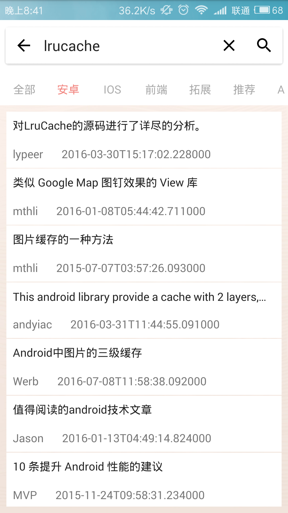
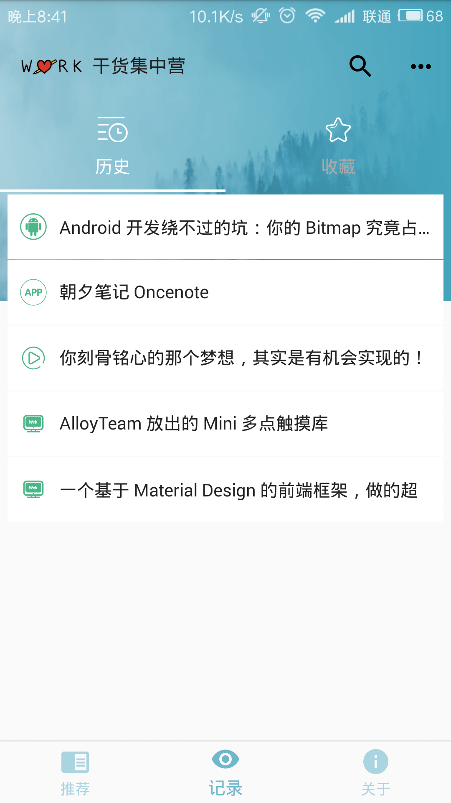
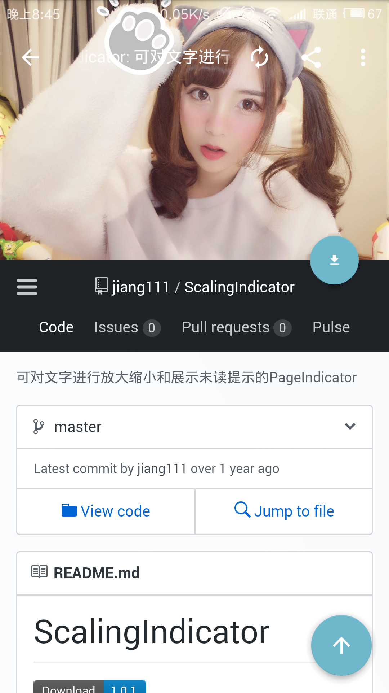

# Gank
- 本应用数据来自代码家的干货网站：http://gank.io ，万分感谢!
- 采用的是MVP思想，整个中基本没有使用什么开源框架，像`Glide、OkHttp、Volley`之类的框架，而是自定义，包括ImageLoader、网络请求之类的、应用中使用
到的第三方类库还是很少的（Google的`Gson`就不算了，毕竟亲儿子算啥），对了，项目中用了Jsoup，用来解析 ‘闲读’ 部分的列表数据。
- 目前来说，代码中还有些写的不太规范的地方，不过这些应该不会影响阅读，我慢慢改☺。
- 总而言之，如果你是新手，并且想多踩踩坑，多些磨砺，那么本应用还是可以作为参考的，毕竟想成为高手，光会引用第三方库是远远不够的。虽然还有很多问题，
但是我会争取一直维护，Have fun！

----

# 应用部分截图

<ul>
 








<ul>

-----

# 版本更新

- 更新版本至V1.1，主要优化如下：
  - 优化ImageLoader，明显优化滑动时列表卡顿的情况
  - 优化ThreadHandler，支持关闭运行线程
  - 其他修改
  


-----


# 下载测试apk
- 在apk文件夹内 `apk/gank-debug.apk`
<a href="apk/gank-debug.apk" target="blank">gank-debug.apk</a>

----
# Bugs
- 已知
  1. Bitmap内存占用大问题尚未解决
 
- 其他bugs。


----

# 作者
其实博客没啥内容，只是做笔记，而没有去整理成博客。

- 简书：http://www.jianshu.com/u/677e2d71d0b1
- GitHub: https://github.com/horseLai

----


# Licence
```
 Copyright (c) 2017 horseLai 

 Licensed under the Apache License, Version 2.0 (the "License");
 you may not use this file except in compliance with the License.
 You may obtain a copy of the License at

     http://www.apache.org/licenses/LICENSE-2.0

 Unless required by applicable law or agreed to in writing, software
 distributed under the License is distributed on an "AS IS" BASIS,
 WITHOUT WARRANTIES OR CONDITIONS OF ANY KIND, either express or implied.
 See the License for the specific language governing permissions and
limitations under the License.
```
