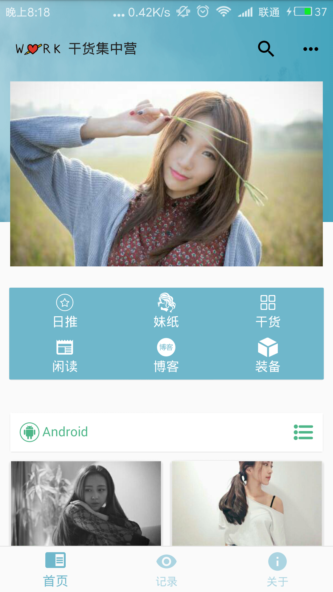

# Gank
- 本应用数据来自代码家的干货网站：http://gank.io ，万分感谢!
- 采用的是MVP思想，整个中基本没有使用什么开源框架，像`Glide、OkHttp、Volley`之类的框架，而是自定义，包括ImageLoader、网络请求之类的、应用中使用
到的第三方类库还是很少的（Google的`Gson`就不算了，毕竟亲儿子算啥），对了，项目中用了Jsoup，用来解析 ‘闲读’ 部分的列表数据。
- 目前来说，代码中还有些写的不太规范的地方，不过这些应该不会影响阅读，我慢慢改☺。
- 总而言之，如果你是新手，并且想多踩踩坑，多些磨砺，那么本应用还是可以作为参考的，毕竟想成为高手，光会引用第三方库是远远不够的。虽然还有很多问题，
但是我会争取一直维护，Have fun！

----

# 应用部分截图

<ul>
 


<ul>

-----

# 版本更新

- 更新版本至V1.1，主要优化如下：
  - 优化ImageLoader，明显优化滑动时列表卡顿的情况
  - 优化ThreadHandler，支持关闭运行线程
  - 其他修改
  

-----


# 下载测试apk
- 在apk文件夹内 `apk/gank-debug.apk`
<a href="apk/gank-debug.apk" target="blank">gank-debug.apk</a>

----
# Bugs
- 已知
  1. 目前来说，还有一些遗留问题，包括Bitmap的`MemoryCache`中的问题，这里面主要涉及图片回收，这个问题目前比较棘手，为什么这么说呢，
因为整个应用中的图片都是乱序的，random请求，所以重复的图片几率还是挺大的，这就导致了如果我在一个地方回收了图片，但是另一个地方还有
引用的情况，并且几率还挺大，也就是意味着报错挂掉的几率挺大，所以我没有在`entryRemove`中主动做回收工作，进而导致OOM的可能性。再提一点，那就是
如果只使用`DiskLruCache`的话，内存抖动很多，并且相对MemoryCache来说，读取速度确实有限、即导致GC频繁导致卡顿，在我的砖头机上测试是比较卡的，
嗯，如果您看到这了，并且有好的想法，希望能多赐教。
  2. `WebView`视频全屏播放时的界面问题。这个呢，主要是跟那个界面布局有关，`AppbarLayout、CollapsingToolbarLayout、toolbar`组合效果，
问题在于它们隐藏之后留下一个白色区域，`GONE`不掉，要想根除，那么只能改布局了，不过暂时不想改变那个布局，因为效果还是挺好的。对此，如果您
有好的建议，希望多赐教，感激。
- 其他bugs。


----

# 作者
其实博客没啥内容，只是做笔记，而没有去整理成博客。

- 简书：http://www.jianshu.com/u/677e2d71d0b1
- GitHub: https://github.com/horseLai

----


# Licence
```
 Copyright (c) 2017 horseLai 

 Licensed under the Apache License, Version 2.0 (the "License");
 you may not use this file except in compliance with the License.
 You may obtain a copy of the License at

     http://www.apache.org/licenses/LICENSE-2.0

 Unless required by applicable law or agreed to in writing, software
 distributed under the License is distributed on an "AS IS" BASIS,
 WITHOUT WARRANTIES OR CONDITIONS OF ANY KIND, either express or implied.
 See the License for the specific language governing permissions and
limitations under the License.
```
